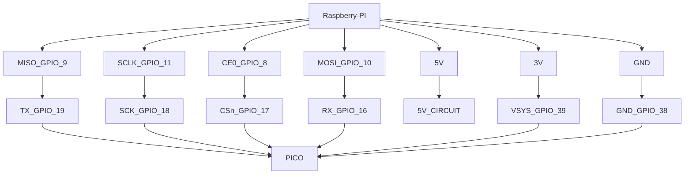
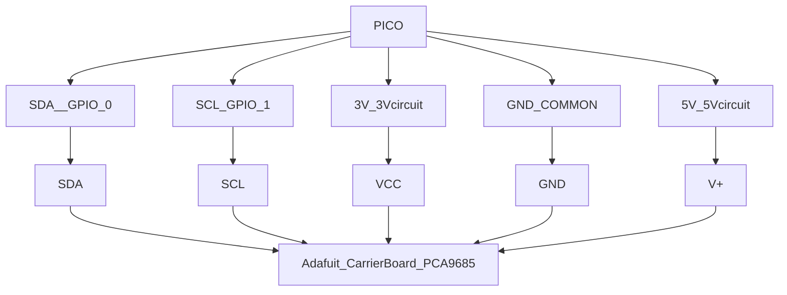

# Tiny Dog Movement Controller

## Use these resources to set up for using this project

follow guides at:

https://blog.smittytone.net/2021/02/02/program-raspberry-pi-pico-c-mac/

then recommended C++ debugging setup

https://blog.smittytone.net/2021/02/05/how-to-debug-a-raspberry-pi-pico-with-a-mac-swd/

## Theory of Operation

Over SPI connection, commands are accepted from main controller detailing positions for points without regard for the actual servo angles or triginomotry required to get there. This allows the controller to take a large amount of the computational load, freeing up the main baord to run it's other supporting programs more effeciently. Simple commands will also be accepted that will allow for even simpler high level control. Each "Extension" has it's own set of motors, lengths and points. The motors can be reused across multiple actuators as well. Also copy extensions can be made which utilize many of the same motors as another extension, but have either a different end effector, or the same endeffector with different motor sets.

Communication is conducted using JSON bodies that utilize the UTF-8 charset. Those bodies and which each one does is explained under the Extension Setup section and explanation.

# Wiring

The SPI connection is made by hooking the MOSI terminal to the GP Pin 16(RX), MISO to GP 19(TX), the clock line(CL,CLK,SCK) to GP 18(SCK), and the chip select to GP17 (CSn). This connects to the picos SPI0 channle and we're setting up CPOL as 0 and CPHA 0. This is the immovable interface that connects our main board to the pico. 

# Servo Control

Servo control is done through a PCA chip on the adafruit carrier board. It would be better for this to be configurable as the extensions are, but for now it is hardcoded as well as the SPI interface. SDA comes from GP 0, SCL comes from GP1, and power and ground also come out of the pico. Any higher voltages needed to run servos should come from an exteneral source grounded to the circuit. 

# Extension Setup

Extensions are singular 3D objects that interact in 3D space. Each extension has one end effector, three motors, and is comprised of two 2D triangles. The points making up the two trianlges comprise the full 3D body. One triangle is the XY map, which creates one triangle to do our math against and calculates the servo motor angles for it. The other is the YZ triangle which acts in a similar manner. The Z plane is not hight in this setup, but is the actual depth from the side view of the extension. (This is not ideal and we'll likely need to be revisited.). Each complex extension is wrapped into a single Extension controller instance, which can have no extensions at all or as many as can be supported in ram. These differntiated on by their "name" field. The controller allows for point commands to be directed to the correct extension, Series runs to be asynchronously processed, and for asynchronous execution of timing serieses. 

## Bodies

### Positioning Motors

The first body that will need to be added is the motors, which you will use to drive your extension. The coordinate field is the 3D vector of the pivot point moved by that motor. So a motor that moves a joint at a distance needs to be given the actual joint coordinate not the motor coordinate exactly.

```json
{
    "command": "POSITIONINGMOTOR",//literal
    "conversionType": "default",//  | quadratic | linear | exponential - this is the type of mathematical conversion used to turn triangle angles into motor angles. The values underlying this are not currently updatable.
    "motorType": "servo",// | brushedMotor | brushlessMotor | stepper
    "movementType": "r",// or l - This determines how the servos new angle for a position will be calculated. A linear("l") one will use arc sign to calculate the angles for a new triangle side length, while a rotational("r") indicates fixed length and will result in a rotational attempt to align points. 
    "servoIndex": 0,//The index of the motor in regards to the motor controller board. The order that it was added is the index in regards to extension contruction
    "inverted": true, // or false depending on whether or not we need to use a complimentary angle to get the expected action.
    "defaultAngle": 90.0,// this default angle will be used as the rest point to calculate new angles from using the default coordinate of the extension. So, the cumulated defaultAngles of an extensions motors, bring it to it's default coordinate
    "servoPosition": [-80.0, 86.61356, 0.0] //3D point coordinate of servo.
    }
```
The easiest path is to create every single motor that will be used before creating extensions. That way you can write them in and then read them out. to ensure everything was interperetted correctly. 

### Extension Trackers

The extension trackers will require a number of arguments around the triangles that make them up, which motor indexes to use, and the default coordinate of the end effector. It is necessary that the default coordinate of the end effector is reached by the selected motors' default angles accumulation. Motors are given in a list that is the order of the X affecting motor, the Y effecting motor, and then the z effecting motor;

```json 
{
    "command": "EXTENSIONTRACKER",//literal
    "name": "rightFrontLeg",
    "defaultCoordinate": [0.0, 0.0, 0.0],
    "servos": [0, 1, 2],
    "xyPlane": [[0.0, 86.61356], [-80.0, 86.61356], [0, 0.0]],
    "yzPlane": [[86.61356, -33.0], [86.61356, 0.0], [0.0, 0.0]]
}
```

### Movement Series

A movement series is a list of points that the Extension it's called for can move to. Each point should meet the minimum requirement for the action you want to actually do. This minimizes the data size transfer and makes the configuration more manageable. Once the transfer is complete, your resolution multiplier will be applied. Every single series is applied to all extensions to help there be less repetitous loads. 

```json
{
    "command": "MOVEMENTSERIES",//literal
    "name": "forwardWalk",
    "type": "some kind of helper marker text",
    "millisecondDelay": 20,//milliseconds between each point aquisition
    "series": [
        [0.0, 30.0, 0.0], 
        [90.0, -20.0, -60.0], 
        [-60.0, -20.0, 60.0]
        ], 
    "resolution": 4//number of iterations the that will be done in the resolution increase
}
```
### Remove all Structures

At times it'll be necessary for development to remove all structures and start over from scratch
this can be done simply with a single command.

```json
 {
    "command": "DELETEALLSTRUCTURES"
 }
```

### Resolution increase

The resolution increase logic simply iterates over a series and calculates the halfway point between each point. this exponentially adds points to smooth out the motion. Notice that the resolution additions wrap around from the first to the last index. removing the need to 

```cpp
void increaseResolution(int resolutionMultiplication)
    {
        for (int m = 0; m < resolutionMultiplication; m++)
        {
            for (int i = 0; i < series.size(); i++)
            {
                int nextIndex = i + 1;
                if (i == series.size() - 1)
                    nextIndex = 0;
                vector<float> newPoint;
                calculateHalfWayDigit(series[i], series[nextIndex], &newPoint);
                if (i != series.size() - 1)
                    series.insert(series.begin() + nextIndex, newPoint);
                else
                    series.push_back(newPoint);
                i++;
            }
        }
    };
```
# Movement Commands

Now that we have everything set up we can start sending commands into the system over the spi interface to actually move our extensions.

### Run a series on an extension for a certain number of iterations

```json
{
    "command": "MOVEMENTSERIES",
    "name": "extensionName",
    "seriesName": "seriesName",
    "iterations": 2
}
```

### Send Extension to point

```json
{
    "command": "EXTENSIONCOMMAND",
    "name": "extensionName",
    "postDelay": 10,
    "coordinate": [20.0, 50.5, 10.2]
}
```

# Read Commands

Read requests come through the same "command" field that differentiates the other requests.

```json
{
    "command": "READMOTORS"
}
```

# Wiring
## Communication Between PI and PICO

## PICO to Adafruit PCA9685 Carrier Board
